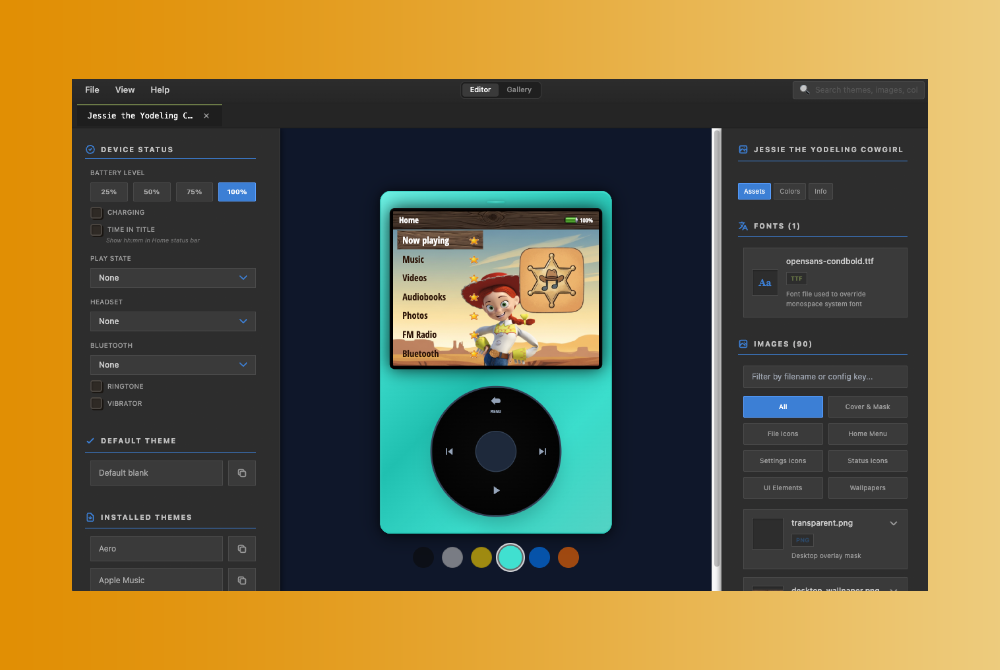

  

# Innioasis Y1 Themes Tool

A visual editor and simulator for creating Innioasis Y1 themes. Build a theme, preview it instantly, and export assets with a clean, predictable structure that matches the device's expectations.

Live app: https://karliky.github.io/InnioasisY1Themes-tool/

## What this app does

- Create and edit `config.json` for Y1 themes with full property coverage.
- Preview UI elements such as menus, dialogs, status icons, and player colors.
- Manage theme assets from a single workspace (`themes/`).
- Export themes in a device-ready folder layout.

## Project structure (high level)

- `App.tsx`, `components/`, `services/` - UI and editor logic
- `themes/` - theme folders and assets used by the editor

## Getting started

**Prerequisites:** Node.js 18+ (Yarn is recommended)

1. Install dependencies:
   `yarn install`
3. Run the dev server:
   `yarn dev`

## Build

`yarn build`

Outputs the static site to `dist/`.

## Deploy (GitHub Pages)

This repo is configured to deploy via GitHub Actions.

1. Push to `main`.
2. Ensure Pages is set to "GitHub Actions" in repository settings.
3. The workflow builds and deploys `dist` automatically.

## License

See `LICENSE`.
